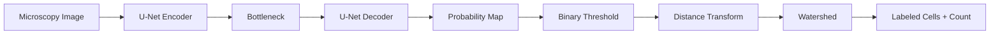

# Cell Segmentation with U-Net

[](https://www.python.org/)
[](https://www.tensorflow.org/)
[](https://github.com/Helios337/Cell-Segmentation-Unet-/actions)
[](LICENSE)

Automatically detect, segment, and count cells in microscopy images using a **U-Net** deep learning model with watershed-based separation of overlapping cells.

## Key Features

- **U-Net Architecture** — Classic encoder-decoder with skip connections, proven for biomedical segmentation
- **Watershed Post-Processing** — Separates touching/overlapping cells for accurate counting
- **Synthetic Data Generation** — Generate realistic cell-like images on-the-fly for instant demo
- **BBBC Dataset Support** — Download real microscopy data from the Broad Bioimage Benchmark Collection
- **Visual Report** — 4-panel output showing original, ground truth, prediction, and labeled count

## Quick Start

```bash
git clone https://github.com/Helios337/Cell-Segmentation-Unet-.git
cd Cell-Segmentation-Unet-
python3 -m venv venv && source venv/bin/activate
pip install -e ".[dev]"

# Run full demo with synthetic data
python main.py
```

## Project Structure

```
├── main.py                 # End-to-end pipeline runner
├── model.py                # U-Net + training + post-processing
├── data_handler.py         # Synthetic data generator + BBBC downloader
├── utils.py                # Image processing + CSV export helpers
├── tests/test_model.py     # Unit tests (dice, loss, post-processing)
├── pyproject.toml          # Package metadata and build config
├── Makefile                # Common commands
├── Dockerfile              # Containerized deployment
└── .github/workflows/ci.yml
```

## How It Works



### Architecture

The U-Net follows the original Ronneberger et al. design:
- **Encoder**: 4 blocks of Conv2D → Dropout → Conv2D → MaxPool (64→128→256→512 filters)
- **Bottleneck**: 2× Conv2D with 1024 filters, 30% dropout
- **Decoder**: 4 blocks of Conv2DTranspose → Concatenate (skip) → Conv2D → Dropout → Conv2D
- **Output**: 1×1 Conv2D with sigmoid activation

### Loss Function

Combined Binary Cross-Entropy + Dice loss:

$`\mathcal{L} = \frac{1}{N}\sum \text{BCE}(y, \hat{y}) + \left(1 - \frac{2|y \cap \hat{y}|}{|y| + |\hat{y}|}\right)`$

This handles class imbalance (cells occupy a small fraction of the image) better than BCE alone.

## Results

On synthetic data (200 samples, 5–25 cells per image):

| Metric | Value |
|---|---|
| Dice Coefficient | ~0.85–0.92 |
| Binary Accuracy | ~0.97–0.99 |
| Cell Count Accuracy | ±1–2 cells |

## Test

```bash
make test
# or
python -m pytest tests/ -v
```